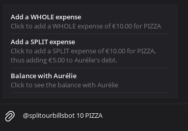
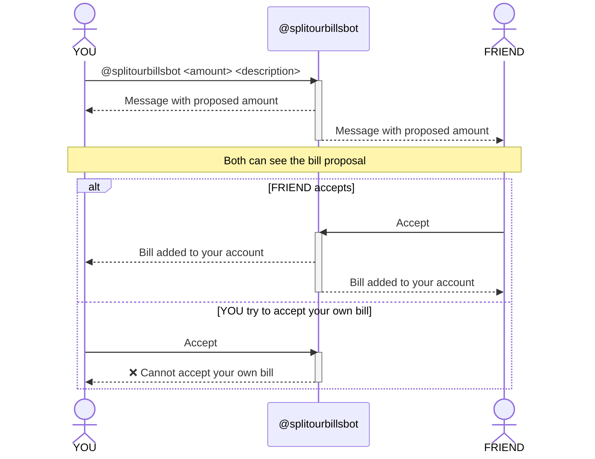

# Split our bills bot!

This bot will help you split your bills with a (one at a time) friend on Telegram. 

## Usage

It can be used inline, by tagging the bot in a chat with the person you want to split the bill with. Start by typing `@splitourbillsbot <amount> <description>` and the bot will guide you through the process.

## Protocol

A message will appear in the chat, with the amount you've proposed to pay. When the other person accepts, the bill will be added on your side of the account of you and your friend. Don't be greedy! Accepting your own bill will not work. 

Once you have an account with some other user, it will appear as soon as you write `@splitourbillsbot` in a chat.

If you press on an account, the balance will be sent in the current chat, and two new buttons will pop out: `Show recent history`, that prints the last 5 things paid by each user with their descriptions, and `Show all history`, that will print a complete Markdown table of the history of your bills.
